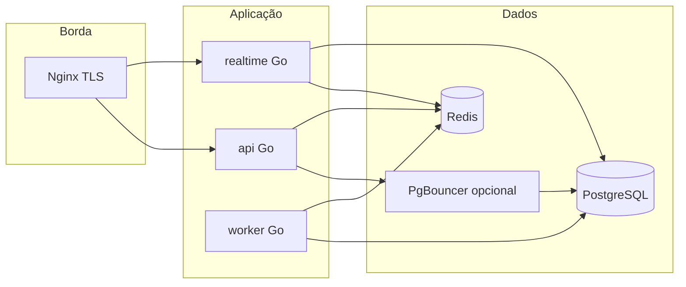

# Harém Brasil — Containerização: arquitetura, API e operações

**Versão:** 1.1 · **Abril de 2026**

**Lane Go (detalhe build/runtime):** **[`CONTAINERIZACAO_GO.md`](./CONTAINERIZACAO_GO.md)** — Dockerfile multi-stage, `cmd/api` / `cmd/realtime` / `cmd/worker`, shutdown gracioso, probes sem ferramentas em distroless, fragmento Compose só Go.

**Relaciona com:** `API_GO_IMPLEMENTACAO.md` / `API_IMPLEMENTACAO_COMPLETA.md` (health checks, prefixos `/api/v1`, WebSocket).

---

## 1. Objetivos e âmbito

Este documento define **como implementar** a plataforma em **contentores OCI** (Docker/Podman), alinhada ao desenho lógico: binários , **PostgreSQL**, **Redis**, **Nginx** (TLS e roteamento), opcionalmente **PgBouncer** e jobs de **migração**.

| Objetivo | Descrição |
|----------|-----------|
| **Paridade dev/prod** | Mesmos artefactos de imagem em CI, staging e produção; diferenças só por configuração (env/secrets). |
| **Segurança** | Utilizador não-root, segredos fora de imagens, rede interna para BD, limites de recursos e de corpo alinhados à API. |
| **Operação na Hostinger** | VPS com Docker ou Podman; Nginx pode correr no host ou em contentor — ambos os modelos estão descritos. |
| **Contrato da API** | Endpoints `GET /healthz` e `GET /readyz` (sem auth) conforme documentação da API; probes de orquestração devem usá-los. |

---

## 2. Mapa de serviços e responsabilidades



| Serviço | Imagem / origem | Porta interna típica | Exposição pública |
|---------|-----------------|----------------------|-------------------|
| **nginx** | `nginx:alpine` (pin por digest em prod) | `80` → mapear só em rede interna se TLS no host | `443` no host ou contentor com volumes de certificados |
| **api** | build multi-stage Go | `8080` (exemplo) | Apenas via Nginx |
| **realtime** | build multi-stage Go | `8081` (exemplo) | WebSocket via Nginx (`Upgrade`) |
| **worker** | build multi-stage Go (mesmo código, `ENTRYPOINT` diferente) | n/a | Não expor |
| **postgres** | `postgres:16-alpine` (versão acordada pela equipa) | `5432` | Só rede `internal`; firewall host reforça |
| **redis** | `redis:7-alpine` | `6379` | Só rede `internal` |
| **pgbouncer** | `edoburu/pgbouncer` ou imagem oficial suportada | `6432` | Só `api` / `realtime` / `worker` |

**Nota:** as portas `8080`/`8081` são exemplos; fixar uma convenção no repositório (`PORT` por serviço) e documentar no OpenAPI apenas o host público (`https://api...`), não portas internas.

---

## 3. Contrato HTTP e probes (API + tempo real)

Conforme `API_IMPLEMENTACAO_COMPLETA.md`:

| Rota | Auth | Uso em contentores |
|------|------|---------------------|
| `GET /healthz` | Não | **Liveness:** processo vivo; não verificar BD (evita reinícios em falhas transitórias de rede). |
| `GET /readyz` | Não | **Readiness:** PostgreSQL (e Redis se obrigatório para arranque) acessíveis; devolver `503` se dependência crítica falhar. |

**Kubernetes / Docker Compose (extensão):**

- **Liveness:** `httpGet` em `http://:<porta>/healthz`, `periodSeconds` moderado (ex.: 30s).  
- **Readiness:** `httpGet` em `/readyz`, falha rápida para retirar do balanceamento.  
- **Startup probe** (opcional): mesmo path que readiness com `failureThreshold` alto para arranque lento após deploy.

O serviço **realtime** deve expor os **mesmos paths** (ou prefixo documentado, ex. `/api/v1/realtime/healthz`) para consistência operacional; se partilharem binário com flags, unificar implementação.

---

## 4. Variáveis de ambiente e segredos

### 4.1 Princípios

1. **Nunca** embutir segredos em Dockerfile (`ARG` sensível evitado; usar BuildKit secrets só para credenciais de *build* privadas, não runtime).  
2. Em produção: ficheiros montados (`/run/secrets/...`), Docker Swarm secrets, Kubernetes `Secret`, ou variáveis injetadas pelo CI na VPS — **não** commitar `.env` com valores reais.  
3. Validar formato e comprimento no arranque (alinhado a OWASP API: input validation).

### 4.2 Tabela mínima sugerida (exemplos de nomes)

| Variável | Serviços | Descrição |
|----------|----------|-----------|
| `APP_ENV` | api, realtime, worker | `development` \| `staging` \| `production` |
| `HTTP_ADDR` | api, realtime | Ex.: `:8080` — escutar em todas as interfaces dentro da rede Docker para o Nginx alcançar. |
| `DATABASE_URL` | api, realtime, worker | URL PostgreSQL ou DSN; preferir **utilizador com privilégios mínimos**; em prod usar PgBouncer (`...@pgbouncer:6432/...`). |
| `REDIS_URL` | api, realtime, worker | URL Redis com TLS se aplicável. |
| `JWT_ISSUER`, `JWT_AUDIENCE`, chave de assinatura | api, realtime | Carregar chave de ficheiro montado (`JWT_KEY_PATH`) em vez de string gigante em env quando possível. |
| `OBJECT_STORAGE_*` | api, worker | Endpoint S3-compatível, região, bucket — chaves via secret. |
| `WEBHOOK_HMAC_SECRET_*` | api, worker | Por PSP; rotação documentada. |
| `LOG_LEVEL` | todos | `info` em prod; `debug` só em ambientes fechados. |
| `OTEL_EXPORTER_OTLP_ENDPOINT` | opcional | OpenTelemetry — rede interna apenas. |

### 4.3 Contentor `migrate` (job)

Executar migrações como **job one-shot** antes de escalar `api`, ou como init controlado no pipeline:

- Imagem: mesma da `api` com `ENTRYPOINT` [`migrate`, `up`] ou binário `goose`/`atlas`.  
- Mesmo `DATABASE_URL` (em staging pode apontar direto ao Postgres; em prod, política da equipa: direto ao Postgres com role de migração **separada** da role da app).

---

## 5. Dockerfile multi-stage (Go)

### 5.1 Padrão recomendado

1. **Stage `build`:** imagem `golang:<versão>-bookworm`, cache de módulos, `CGO_ENABLED=0` se possível (imagem menor e menos superfície de ataque).  
2. **Stage `runtime`:** `FROM gcr.io/distroless/static-debian12:nonroot` (ou `alpine` com utilizador não-root se precisar de shell para debug pontual).  
3. Copiar apenas o binário e CA certs se necessário para TLS outbound.  
4. `USER nonroot:nonroot`.  
5. **Não** incluir código-fonte, testes nem `.git` na imagem final.

### 5.2 Três alvos a partir do mesmo contexto

| Alvo | Argumento | Resultado |
|------|-------------|-------------|
| `api` | `TARGET=cmd/api` | Servidor REST |
| `realtime` | `TARGET=cmd/realtime` | WebSocket |
| `worker` | `TARGET=cmd/worker` | Filas, webhooks, jobs |

Exemplo ilustrativo (ajustar paths ao repositório real):

```dockerfile
# syntax=docker/dockerfile:1
ARG GO_VERSION=1.24
FROM golang:${GO_VERSION}-bookworm AS build
WORKDIR /src
COPY go.mod go.sum ./
RUN go mod download
COPY . .
ARG TARGET=cmd/api
RUN CGO_ENABLED=0 go build -trimpath -ldflags="-s -w" -o /out/app ./${TARGET}

FROM gcr.io/distroless/static-debian12:nonroot
COPY --from=build /out/app /app
ENV HTTP_ADDR=:8080
EXPOSE 8080
USER nonroot:nonroot
ENTRYPOINT ["/app"]
```

**Sinais:** garantir que o processo Go trata `SIGTERM` para **shutdown gracioso** (fechar servidor HTTP, drenar conexões WebSocket com timeout configurável).

---

## 6. Rede Docker

### 6.1 Redes

- **`harem_internal`:** `postgres`, `redis`, `pgbouncer`, `api`, `realtime`, `worker`, `nginx` (lado upstream). **Driver:** bridge.  
- Não publicar `5432`/`6379` no host em produção; se necessário para debug, usar túnel SSH ou porta temporária com firewall.

### 6.2 DNS entre serviços

Usar nomes de serviço estáveis (`postgres`, `redis`, `api`) como host em URLs; evitar IPs fixos.

### 6.3 Nginx → upstreams

```nginx
upstream api_upstream {
    server api:8080;
    keepalive 32;
}
upstream rt_upstream {
    server realtime:8081;
    keepalive 16;
}
```

- `proxy_http_version 1.1;`, `proxy_set_header Connection "";` para keepalive.  
- WebSocket: `proxy_set_header Upgrade $http_upgrade;`, `proxy_set_header Connection "upgrade";`, timeouts alinhados ao produto.  
- `client_max_body_size` alinhado aos limites da API (JSON, multipart metadados).

---

## 7. Docker Compose (desenvolvimento)

### 7.1 Ficheiros sugeridos

| Ficheiro | Função |
|----------|--------|
| `deploy/compose/docker-compose.yml` | Serviços base: postgres, redis, api, realtime, worker, nginx opcional. |
| `deploy/compose/docker-compose.override.yml` | Montagens de código hot-reload **apenas** local (gitignored em alternativa). |
| `deploy/compose/docker-compose.prod.yml` | Overrides de produção: política de restart, limites CPU/RAM, sem portas DB expostas. |

### 7.2 Ordem de arranque

1. `postgres` + `redis` com **healthcheck** nativo (`pg_isready`, `redis-cli ping`).  
2. Job `migrate` com `depends_on: postgres: condition: service_healthy`.  
3. `api`, `realtime`, `worker` com `depends_on` em `postgres`/`redis` (e `pgbouncer` se existir).  
4. `nginx` por último.

### 7.3 Volumes

- **PostgreSQL:** volume nomeado persistente (`pgdata`).  
- **Redis:** em dev pode ser efémero; em staging/prod definir persistência ou aceitar perda de filas não críticas (documentar).  
- **Uploads / mídia:** preferir object storage; volume local só para dev.

### 7.4 Limites (API4 — consumo de recursos)

Definir no Compose (ou orquestrador):

```yaml
deploy:
  resources:
    limits:
      cpus: "1.0"
      memory: 512M
    reservations:
      memory: 256M
```

Ajustar após benchmarks; o **worker** de processamento pesado pode ter limites distintos da `api`.

---

## 8. Produção na VPS (Hostinger)

### 8.1 Modelo A — Nginx no host, apps em Docker

- Certificados Let's Encrypt no host (Certbot).  
- Nginx escuta `443` e faz `proxy_pass` para `127.0.0.1:<porta>` mapeada só em `localhost` a partir dos contentores (`ports: "127.0.0.1:8080:8080"`).  
- **Vantagem:** TLS e renovação já familiares às equipas; menos contentores na borda.

### 8.2 Modelo B — Tudo em Docker (incluindo Nginx)

- Contentor Nginx com volumes read-only para config e para `/etc/letsencrypt` ou certificados sincronizados.  
- **Cuidado:** renovação Certbot (sidecar ou cron no host que recarrega Nginx).

### 8.3 PostgreSQL em contentor vs nativo

| Opção | Quando usar |
|-------|-------------|
| **Nativo no VPS** | Melhor I/O previsível; backups `pg_dump` no host; alinhado à secção 10.3 da arquitetura. |
| **Contentor** | Paridade total com dev; usar volume dedicado em disco rápido; backups para object storage ou segundo disco. |

Em ambos os casos: **firewall** (`ufw`) coerente com a arquitetura; a app nunca expõe Postgres publicamente.

---

## 9. Observabilidade e logging

| Aspeto | Implementação em contentores |
|--------|------------------------------|
| **Logs** | JSON para `stdout`/`stderr`; driver `json-file` com `max-size` e `max-file` para evitar encher disco. |
| **Métricas** | Endpoint Prometheus na app **só** em rede interna ou porta não publicada; Nginx `stub_status` opcional interno. |
| **Tracing** | OTLP para collector na mesma rede Docker ou agente no host. |

**Segurança (API10):** não logar corpos completos de pedidos em rotas sensíveis; mascarar identificadores conforme política LGPD.

---

## 10. CI/CD e imagens

1. **Build:** `docker buildx build --platform linux/amd64` (e `arm64` se VPS multi-arquitetura).  
2. **Scan:** Trivy ou Grype na pipeline em imagens finais; falhar em CVEs críticos não mitigáveis.  
3. **Registry:** GitHub Container Registry, GitLab Registry ou privado; tags `:<git-sha>` + `:staging` / `:production` com promoção explícita.  
4. **Assinatura:** Cosign (recomendado antes de produção madura).

---

## 11. Segurança (checklist OWASP / operação)

- [ ] Utilizador não-root em todas as imagens de aplicação.  
- [ ] Read-only root filesystem onde o runtime permitir (`read_only: true` + `tmpfs` para dirs necessários).  
- [ ] Capabilities mínimas (`cap_drop: ALL` e adicionar só o indispensável).  
- [ ] `security_opt: no-new-privileges:true`  
- [ ] Rate limiting na borda (Nginx `limit_req`) + na aplicação (conforme API).  
- [ ] CORS e headers de segurança na camada que serve o SPA; API JSON com política separada.  
- [ ] Segredos de webhook e JWT fora do Git; rotação documentada.  
- [ ] Imagens base **pinadas** por digest em produção.

---

## 12. Webhooks e worker

- Rotas `/api/v1/webhooks/*` podem estar no `api` ou isoladas num listener do `worker` atrás do mesmo Nginx com path dedicado — **importante:** validação de assinatura e idempotência antes de qualquer efeito colateral.  
- O worker deve aceder a Postgres/Redis pela rede `internal` apenas.  
- Escalabilidade: múltiplas réplicas do worker com **locks** ou filas consumidas atomicamente (Redis Streams, etc.) para evitar processamento duplicado.

---

## 13. Extensão opcional: serviços .NET (ADR)

Se um ADR aprovar workers ou admin em **ASP.NET Core**:

- Imagem base `mcr.microsoft.com/dotnet/aspnet:<LTS>-alpine` (ou distroless equivalente quando disponível).  
- Mesmas regras de rede, secrets e health (`/healthz`, `/readyz`).  
- Não misturar rotas `/api/v1/admin` públicas sem fronteira clara com o núcleo Go — ver arquitetura (BFLA).

---

## 14. Referência rápida — ficheiros a criar no repositório

Quando existir código Go, recomenda-se:

```
deploy/
  compose/
    docker-compose.yml
    docker-compose.prod.yml
  nginx/
    nginx.conf
    snippets/
      security-headers.conf
  docker/
    Dockerfile.api
    # ou Dockerfile único com --target
```

Manter este documento atualizado quando mudarem versões de Postgres/Redis, paths de health ou política de migrações.

---

*Documento alinhado à versão 1.2 da arquitetura e 1.2 da API (abril 2026).*
